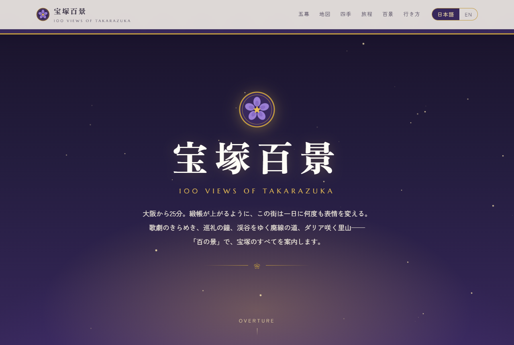
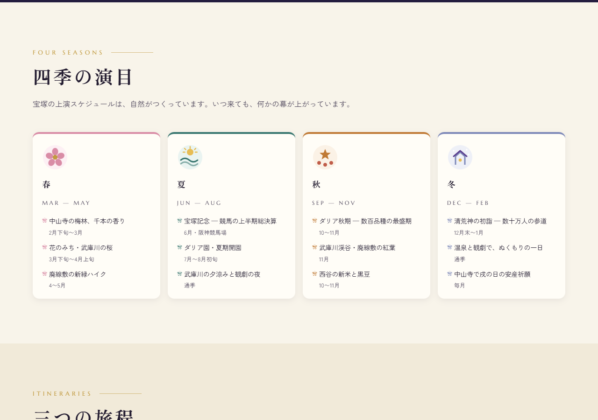
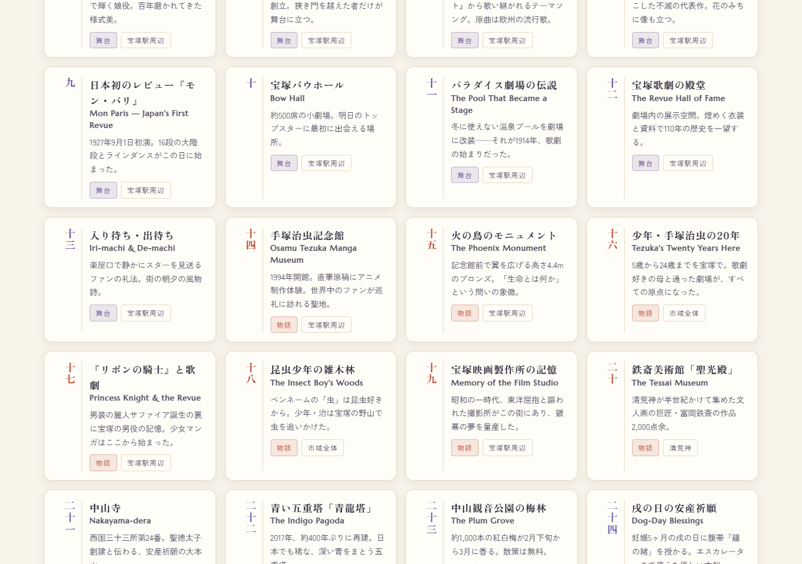

# 宝塚百景 — TAKARAZUKA HYAKKEI
### 100 Views of Takarazuka — A city that raises the curtain.

世界中の人に宝塚市を「隅々まで」知ってもらい、「来てみたい」と思ってもらうための、完全オリジナル・バイリンガル（日英）Webサイト。

**🌐 公開中: <https://umine2025.github.io/takarazuka-hyakkei/>**（GitHub Pages / 公開費用 ¥0 / 外部依存なし）



| 体感型市域マップ | 百景図鑑（検索・絞り込み） |
|---|---|
|  |  |

---

## コンセプト

> 歌川広重の「名所江戸百景」のように、宝塚を **百の景** で描く。

宝塚は「歌劇の街」として知られますが、それは幕開けにすぎません。手塚治虫が青春を過ごした街、ウィルキンソン炭酸が生まれた街、日本三大植木産地・山本、巡礼の寺、武庫川渓谷の廃線跡、市域の大半を占める北部・西谷の里山とダリア畑——。本サイトは市全体をひとつの「劇場」に見立て、**五幕の物語 + 体感型市域マップ + 百景図鑑** で、観光パンフレットが届かない「隅々」まで案内します。

### サイト構成（一枚の舞台）

| 幕 | セクション | 内容 |
|---|---|---|
| 序 | **Overture** | 緞帳が上がるヒーロー演出・市の自己紹介 |
| 第一幕 | **The Revue** | 宝塚歌劇・音楽学校・花のみち・タカラジェンヌ文化 |
| 第二幕 | **The God of Manga** | 手塚治虫と宝塚（5〜24歳を過ごした街） |
| 第三幕 | **Waters** | 武庫川・宝塚温泉・ウィルキンソン炭酸誕生秘話・炭酸せんべい |
| 第四幕 | **Paths** | 巡礼と山道 — 中山寺・清荒神・小浜宿・武庫川渓谷廃線敷 |
| 第五幕 | **Fields** | 北部・西谷 — ダリア園・植木のまち山本・湿原・里山 |
| 幕間 | **City Map** | クリックで巡る様式化SVG市域マップ |
| - | **Four Seasons** | 季節カレンダー（梅・桜・宝塚記念・花火・ダリア・初詣） |
| - | **Itineraries** | モデルコース3種（半日／1日／1泊2日） |
| - | **100 Views** | 百景図鑑 — カテゴリ絞り込み付き全100項目 |
| 終幕 | **Access** | 大阪・京都・神戸・関空からのアクセス、実用情報 |

## 設計方針

- **言語**: 日英バイリンガル（トグル切替・`localStorage`保存・ブラウザ言語自動判定）
- **画像**: すべてオリジナルSVGアートワーク（権利問題ゼロ・軽量・高精細）
- **技術**: 純粋な HTML/CSS/JS。ビルド不要・フレームワーク不要・依存は Google Fonts のみ
- **デザイン**: すみれ紫 × 舞台金 × 武庫川の青磁。明朝体の品格 × 劇場のドラマ
- **アクセシビリティ**: セマンティックHTML / `prefers-reduced-motion` 対応 / キーボード操作可
- **SEO**: OGP / JSON-LD (TouristDestination) / 日英メタデータ

## ファイル構成

```
_takarazuka/
├── README.md          ← このファイル
├── index.html         ← サイト本体（全セクション）
├── css/style.css      ← デザインシステム
├── js/main.js         ← 言語切替・マップ・百景フィルタ・演出
├── js/views-data.js   ← 百景データ（日英対訳100項目）
├── assets/            ← favicon.svg / ogp.png（make_ogp.py で生成）
├── research/          ← リサーチ資料（事実確認の根拠・出典URL付き）
├── docs/              ← README用スクリーンショット
├── qa/                ← 検証スクリプト（公開物には不要）
└── .nojekyll          ← GitHub Pages用
```

## ビルド（コンテンツ更新時のみ）

百景データ（`js/views-data.js`）を更新したら、SEO/LLMO成果物を再生成:

```powershell
node tools/merge-episodes.mjs   # research/episodes/*.verified.json → views-data.js に統合
node tools/prerender.mjs        # 静的グリッドHTML / ItemList JSON-LD / llms-full.txt / sitemap.xml を再生成
```

## SEO / LLMO 対策一覧

- **静的プリレンダリング**: 百景100件＋エピソードを index.html に直接埋め込み（JS不要で全文クロール可能、JSは絞り込みのみ担当）
- **構造化データ**: TouristDestination / WebSite / FAQPage / ItemList（100×TouristAttraction、`#view-N` ディープリンク付き）
- **LLMO**: `llms.txt`（サイト要約・主要事実）+ `llms-full.txt`（百景全文Markdown）— llmstxt.org 規約準拠
- **`robots.txt` / `sitemap.xml`**: AIクローラー含め全許可
- **正規URL・OGP絶対URL・og:locale (ja_JP / en_US)**・全要素への `lang` 属性

## 無料公開の手順（GitHub Pages）

```powershell
cd C:\Users\junna\Documents\Claude\_takarazuka
git init && git add -A && git commit -m "feat: Takarazuka Hyakkei v1"
gh repo create takarazuka-hyakkei --public --source . --push
gh api repos/{owner}/takarazuka-hyakkei/pages -X POST -f "source[branch]=main" -f "source[path]=/"
# → https://<username>.github.io/takarazuka-hyakkei/ で公開
```

独自ドメイン不要・サーバー費用不要・常時無料。

## 制作体制（オーケストレーション）

| 役割 | 担当 | モデル/エフォート |
|---|---|---|
| 総合演出・設計・実装・デザイン | Fable 5（本体） | 最高品質 |
| 事実リサーチ（4領域並列） | general-purpose agents ×4 | Sonnet（Web検索・出典付き） |
| コード/アクセシビリティレビュー | code-reviewer / a11y-architect | Sonnet |
| 画像素材 | オリジナルSVG（Fable 5 設計） | — |

> 事実情報（開館時間・料金・イベント日程）は変動します。research/ の出典を元に作成していますが、訪問前に公式サイトの確認を促す注記をサイト内に明記しています。

## ライセンス

- コード: MIT
- 文章・SVGアートワーク: © 2026 Takarazuka Hyakkei Project（個人利用・共有歓迎、出典明記）

---

*Made with love from Takarazuka, Hyogo — すみれの花の咲く街から。*
