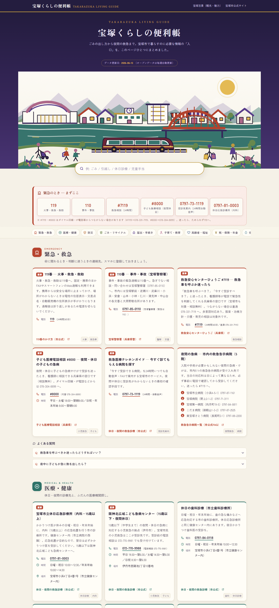
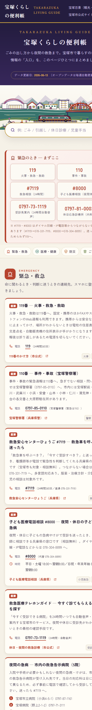

# 宝塚くらしの便利帳 — Takarazuka Living Guide

宝塚市に住む人のための、生活情報をひとつにまとめた無料ポータル。
**公開先: <https://takarazuka.jun-nakatani.com/life/>**（Cloudflare Pages / 公開費用 ¥0）

姉妹サイト「[宝塚百景](../README.md)」（観光・魅力発信）に対し、こちらは**市民の実用情報**に特化する。

| デスクトップ | モバイル |
|---|---|
|  |  |

---

## コンセプト

> 困ったとき・調べたいときに「まずここを開けば入口が見つかる」テーマ別ポータル。

市公式サイトは情報が深い階層に分かれていて、目的のページに辿り着くまでが大変。
本サイトは **「入口の地図」** に徹する — 各テーマの要点（連絡先・時間・費用・手順）を一覧化し、正確な詳細は必ず市公式ページへリンクで誘導する。

### 設計原則

1. **正確性最優先** — 全項目に市公式サイト等の出典URLを付与。電話番号・緊急情報は複数ソースで照合。不確実な情報は載せない。
2. **テーマ別マルチページ** — ハブ（`/life/`）＋カテゴリ別12ページ（`/life/<id>/`）に分割。1ページが長くなりすぎず、検索流入はトピックの専用URLへ直接着地（SEO/LLMO最適）。
3. **緊急情報は最短距離** — 全ページ上部に緊急バナー。3タップ以内で 119/110/#7119 に到達。
4. **横断検索** — 全ページ共通の検索バーが `search-index.json` を読み、どのページからでも該当ページ#該当項目へ直接リンク。
5. **自動更新** — 宝塚市オープンデータ（CC BY 4.0）を GitHub Actions が定期取得し、避難所・AED・施設・イベント情報を自動で再生成・再デプロイ。
6. **静的プリレンダ** — 全コンテンツをHTMLに焼き込み（JS不要で全文閲覧可）。JSは横断検索・絞り込みの強化のみ。
7. **モバイルファースト** — 外出先のスマホ利用を第一に。

## コンテンツ構成

| # | セクション | 主な内容 | データソース |
|---|---|---|---|
| 1 | 緊急・救急 | 110/119/#7119/#8000、休日・夜間診療、当番医 | 市公式（照合済み） |
| 2 | 防災 | 指定避難所一覧、ハザードマップ、防災情報の入手先 | **オープンデータ（自動更新）** |
| 3 | ごみ・リサイクル | 分別区分、収集日、粗大ごみの出し方・料金 | 市公式 |
| 4 | 届出・手続き | 引越し・証明書・マイナンバー、窓口と開庁時間 | 市公式 |
| 5 | 子育て・教育 | 妊娠〜子育て支援、保育所・幼稚園、医療費助成、赤ちゃんの駅 | 市公式＋**オープンデータ** |
| 6 | 医療・健康 | 健診・予防接種、AED設置場所 | 市公式＋**オープンデータ** |
| 7 | 高齢者・福祉 | 地域包括支援センター、介護保険、障害福祉 | 市公式 |
| 8 | 税・保険・年金 | 市税・国民健康保険・年金の窓口 | 市公式 |
| 9 | 住まい・ライフライン | 上下水道、電気・ガス、市営住宅 | 市公式 |
| 10 | 交通 | 阪急・JR・バス・駐輪場 | 市公式＋事業者公式 |
| 11 | 施設 | 図書館、公民館、スポーツ施設、公衆Wi-Fi、公衆トイレ | **オープンデータ（自動更新）** |
| 12 | イベント・相談窓口 | 市イベント情報（XML）、各種相談窓口 | **オープンデータ（自動更新）** |

## アーキテクチャ

```
life/                       ← *.html と search-index.json は prerender-life.mjs が生成（手動編集しない）
├── README.md               ← このファイル
├── index.html              ← ハブ（トップ）: ヒーロー＋検索＋緊急＋カテゴリカード＋イベント抜粋
├── <id>/index.html         ← カテゴリ別ページ ×12（emergency, medical, disaster, garbage,
│                              procedure, childcare, welfare, tax, lifeline, transport, facility, events）
├── search-index.json       ← 全ページ横断検索インデックス（69項目）
├── life.css                ← デザインシステム（百景ブランドの実用版）
├── life.js                 ← 横断検索・絞り込み（プログレッシブ強化／JSなしでも全文閲覧可）
├── assets/                 ← hero.svg / ogp.png
└── data/                   ← ビルド入力（公開物には含めない）
    ├── guide.json          ← 編集コンテンツ（リサーチ済み・出典付き・唯一の手編集対象）
    └── opendata/*.json     ← オープンデータ変換結果（避難所/AED/施設/イベント…）

tools/
├── fetch-opendata.mjs      ← 市オープンデータ取得 → life/data/opendata/*.json
├── prerender-life.mjs      ← guide.json + opendata → ハブ＋12ページ＋search-index＋llms-life.txt＋sitemap追記
└── build-public.mjs        ← public/ へ life/ をまるごと収集（data/・README は除外）

.github/workflows/
├── deploy.yml              ← push → prerender → prerender-life → build-public → Cloudflare Pages
└── update-data.yml         ← 週次cron → データ取得 → 差分あれば再ビルド&デプロイ&コミット
```

> ルーティング: 全ページがサイトルート絶対パス（`/life/...`・`/`）でアセット/リンクを参照。
> Cloudflare Pages は `/life/<id>/` を `life/<id>/index.html` として自動配信。

### 自動更新フロー

```
毎週月曜 06:00 JST (GitHub Actions cron)
  → node tools/fetch-opendata.mjs   # 市オープンデータ取得（CSV/XLSX/XML → JSON）
  → 差分チェック（変化なしなら終了）
  → node tools/prerender-life.mjs   # 静的HTML再生成
  → Cloudflare Pages デプロイ
  → main へ自動コミット（[bot] data update）
```

## SEO / LLMO

- 全データを**静的HTML**として配信（JS不要で全文読める）
- ページ単位の最適化: カテゴリごとに専用 `title` / `description` / `canonical` / OGP を生成
- JSON-LD: ハブは `WebSite` + `CollectionPage` + `BreadcrumbList` + `ItemList`、各カテゴリは `WebPage` + `BreadcrumbList` + `FAQPage` + `Dataset`（オープンデータ出典明記）
- `llms.txt` に /life/ セクション、`llms-life.txt`（全文プレーンテキスト版・各テーマのURL付き）を生成
- `sitemap.xml` へハブ＋12カテゴリURLを反映（オープンデータ系は `weekly`）
- 見出しは住民の検索語そのまま（「宝塚市 ごみ 分別」「宝塚市 休日診療」等）に対応する構成

## デザイン

- 百景ブランド（すみれ紫 × 舞台金 × 和紙）を継承しつつ、**実用情報向けに再構成**
- カテゴリ別カラーコード、大きめのタップターゲット、カード型レイアウト
- 緊急セクションは朱色で常に最上部・高コントラスト
- `Zen Kaku Gothic New` 主体（本文の可読性）+ 見出しに `Zen Old Mincho`（ブランド連続性）
- アクセシビリティ: セマンティックHTML / WCAG AA コントラスト / キーボード操作 / `prefers-reduced-motion`

## ライセンス・出典

- 宝塚市オープンデータ: [CC BY 4.0](https://creativecommons.org/licenses/by/4.0/deed.ja) — 出典「宝塚市」をページ内・データ内に明記
- 本サイトは**非公式**の個人制作。最新・正確な情報は必ず[宝塚市公式サイト](https://www.city.takarazuka.hyogo.jp/)で確認のこと（ページ内にも明記）

## 運用

- デプロイ: `node tools/deploy.mjs`（既存ワンコマンド）または main へ push
- データ手動更新: `node tools/fetch-opendata.mjs && node tools/prerender-life.mjs`
- 検証: `node tools/verify-live.mjs`（/life/ チェックを追加）
